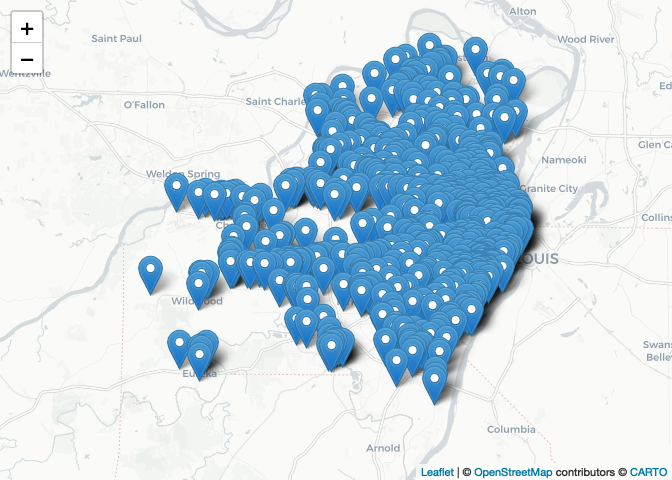

Lab-01 Replication File
================
Christopher Prener, Ph.D.
(February 01, 2021)

## Introduction

This notebook provides a structure for completing the first lab.

## Instructions

Using this notebook, load the file `data/STL_FOOD_Grocery.geojson` into
`R`. Then, create a `leaflet` map of your own design that also has a
popup providing the name of the grocery store. *Note that I’ve given you
the structure and packages for this week - in future weeks - you’ll need
to figure this bit out as part of the assignment!*

## Dependencies

This notebook requires the following packages:

``` r
# tidyverse packages
library(magrittr)     # pipe operator
library(readr)        # csv tools

# mapping packages
library(mapview)      # preview spatial data
```

    ## GDAL version >= 3.1.0 | setting mapviewOptions(fgb = TRUE)

``` r
library(leaflet)      # interactive maps
library(sf)           # spatial tools
```

    ## Linking to GEOS 3.8.1, GDAL 3.1.4, PROJ 6.3.1

``` r
# other packages
library(here)         # file path management
```

    ## here() starts at /Users/chris/GitHub/slu-soc5650/module-1-intro/assignments/lab-01-replication

## Load Data

&lt; add your narrative text here &gt;

``` r
# Food Retail in St. Louis
grocery <- st_read(here("data", "STL_FOOD_Grocery.geojson")) 
```

    ## Reading layer `grocery' from data source `/Users/chris/GitHub/slu-soc5650/module-1-intro/assignments/lab-01-replication/data/STL_FOOD_Grocery.geojson' using driver `GeoJSON'
    ## Simple feature collection with 685 features and 5 fields
    ## geometry type:  POINT
    ## dimension:      XY
    ## bbox:           xmin: -90.69589 ymin: 38.46747 xmax: -90.18662 ymax: 38.82457
    ## geographic CRS: WGS 84

## Map Grocery Stores

&lt; add your narrative text here &gt;

``` r
leaflet(data = grocery) %>%
  addProviderTiles(providers$CartoDB.Positron) %>%
  addMarkers(popup = ~title)
```

<!-- -->
