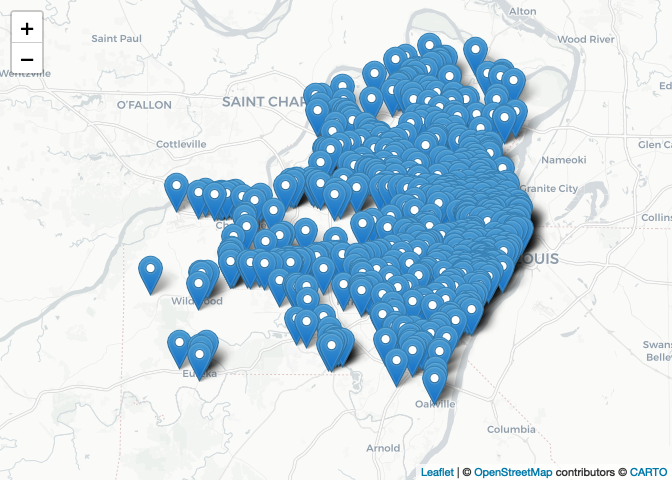

Lab-1-1 Replication File
================
Christopher Prener, Ph.D.
(January 24, 2022)

## Introduction

This notebook provides a structure for completing the first lab.

## Instructions

Using this notebook, load the file `data/STL_FOOD_Grocery.geojson` into
`R`. Then, create a `leaflet` map of your own design that also has a
popup providing the name of the grocery store. *Note that I’ve given you
the structure and packages for this week - in future weeks - you’ll need
to figure this bit out as part of the assignment!*

## Dependencies

This notebook requires the following packages:

``` r
# tidyverse packages
library(magrittr)     # pipe operator
library(readr)        # csv tools

# mapping packages
library(mapview)      # preview spatial data
library(leaflet)      # interactive maps
library(sf)           # spatial tools
```

    ## Linking to GEOS 3.8.1, GDAL 3.2.1, PROJ 7.2.1; sf_use_s2() is TRUE

``` r
# other packages
library(here)         # file path management
```

    ## here() starts at /Users/prenercg/GitHub/slu-soc5650/meetings/module-1-intro/assignments/lab-1-1-replication

## Load Data

We’ll start by loading the grocery store data from our `data` folder.

``` r
# Food Retail in St. Louis
grocery <- st_read(here("data", "STL_FOOD_Grocery.geojson")) 
```

    ## Reading layer `grocery' from data source 
    ##   `/Users/prenercg/GitHub/slu-soc5650/meetings/module-1-intro/assignments/lab-1-1-replication/data/STL_FOOD_Grocery.geojson' 
    ##   using driver `GeoJSON'
    ## Simple feature collection with 685 features and 5 fields
    ## Geometry type: POINT
    ## Dimension:     XY
    ## Bounding box:  xmin: -90.69589 ymin: 38.46747 xmax: -90.18662 ymax: 38.82457
    ## Geodetic CRS:  WGS 84

## Map Grocery Stores

We’re going to map our grocery store data with a custom provided
basemap, and popups.

``` r
leaflet(data = grocery) %>%
  addProviderTiles(providers$CartoDB.Positron) %>%
  addMarkers(popup = ~title)
```

<!-- -->
