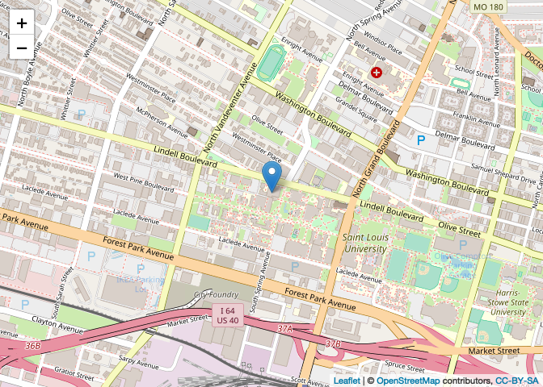
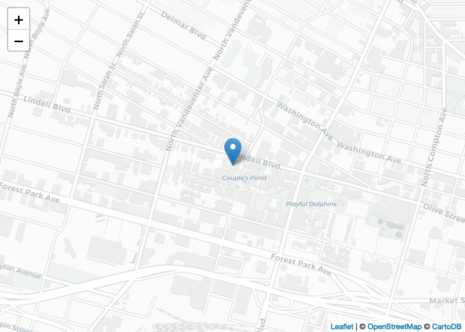
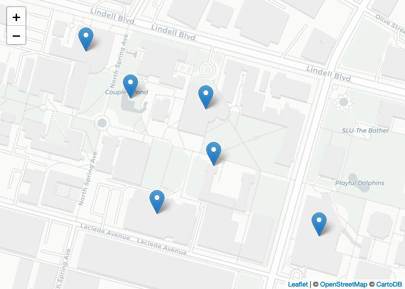
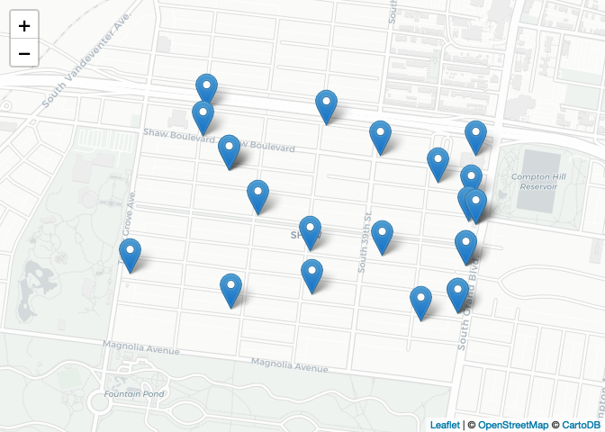
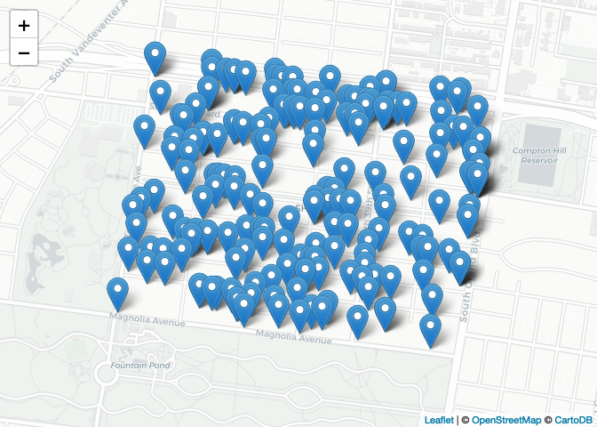

Lecture-01 Example Code
================
Christopher Prener, Ph.D.
(January 22, 2019)

## Introduction

This notebook provides a walk-through of the example code used in class.

## Dependencies

This notebook requires the following packages:

``` r
# tidyverse packages
library(magrittr)     # pipe operator
library(readr)        # csv tools

# mapping packages
library(leaflet)      # interactive maps
library(sf)           # spatial tools
```

    ## Linking to GEOS 3.6.1, GDAL 2.1.3, PROJ 4.9.3

``` r
# other packages
library(here)         # file path management
```

    ## here() starts at /Users/chris/GitHub/SOC5650/LectureRepos/lecture-01

## Leaflet

As a way to get to know `R` and RStudio, we’ll be working with the `R`
package [`leaflet`](https://rstudio.github.io/leaflet/). `leaflet` is
the `R` implementation of [`leaflet.js`](http://leafletjs.com), an
open-source Java Script library for building interactive maps.

### A Simple Map

`leaflet` itself is straightforward to get up and running. If we wanted
an interactive map with a marker placed on-top of Morrissey Hall, we
would use the following script entered into `R`:

``` r
leaflet() %>%
  addTiles() %>%
  addMarkers(lng=-90.237104, lat=38.637547, popup="Morrissey Hall")
```

<!-- -->


The `leaflet()` function creates a map widget, and the `addTiles()`
function adds a basemap to it. By default,
[OpenStreetMap](https://www.openstreetmap.org) is used for the basemap.
Finally, we use `addMarkers()` to specify the longitude and latitude of
our marker, and we enter in a label that will appear as a pop-up when a
user clicks on the marker. `lng`, `lat`, and `popup` are all called
“arguments” - these are used to control how a function operates.

The `%>%` is called the “pipe operator”, and it is used to chain
together functions in what we will call “pipelines”. This pipeline can
be read like a list, with the word **then** substituted for each
instance of `%>%`:

1.  First we create a map widget, **then**
2.  we add basemap tiles, **then**
3.  we add a marker at the given longitude and latitude.

### Changing the Basemap

To alter the basemap, we can use `addProviderTiles()` in place of
`addTiles()`. I like the CartoDB “Positron” basemap. To use the Positron
basemap, we create a second pipeline:

``` r
leaflet() %>%
  addProviderTiles(providers$CartoDB.Positron) %>% 
  addMarkers(lng=-90.237104, lat=38.637547, popup="Morrissey Hall")
```

<!-- -->

Two things are important to note here. When we load the `leaflet`
package, we have access to a data object called `providers`. You can use
`names(providers)` to explore it. `providers` is a vector of items, each
of which corresponds to a different basemap. We can select one of those
items, `CartoDB.Positron`, by separating `providers` from the item name
with a dollar sign (`$`). This is a classic way in which elements of a
data set are accessed in `R` syntax.

### Adding Additional Points

The `data/sluPlaces.csv` file (a `.csv` file is a type of spreadsheet)
contains information on a couple of other places where I find myself
regularly on campus. We can read it into `R` using the `readr` package
(part of the tidyverse):

``` r
sluPlaces <- read_csv(here("data", "sluPlaces.csv"))
```

    ## Parsed with column specification:
    ## cols(
    ##   id = col_double(),
    ##   name = col_character(),
    ##   lng = col_double(),
    ##   lat = col_double()
    ## )

We read the statement from right to left - the data found at
`data/sluPlaces.csv` is read correctly as `.csv` data, and the resulting
imported data is stored in an object in our global enviornment named
`sluPlaces`. The `here()` function helps us write simple, operating
system agnostic file paths that will always be relative to where the
`.Rproj` file is stored. We’ll talk more about this as the semester
progresses.

The `.csv` data are *tabular* data - they contain longitude and latitude
data, but they are not *projected*. This means we are missing the
geometric data that locates these longitude and latitude data in space.
leaflet can take these spatial references, however, and convert them to
useable geometric data. We do so using a very similar process to what we
did before:

``` r
leaflet(data = sluPlaces) %>%
  addProviderTiles(providers$CartoDB.Positron) %>% 
  addMarkers(lng = ~lng, lat = ~lat, popup = ~name)
```

<!-- -->

The `data = sluPlaces` argument in `leaflet()` directs `R` to the
appropriate data set to map. We use the tilde (`~`) to indicate to
leaflet that these are variables within `sluPlaces`.

### Reading in Spatial Data

For data that have already been converted to geometric data, we use the
`sf` package to read them. The importing process looks similar to what
we used with the `.csv` file. We’ll demonstrate this with the violent
crime data for
Shaw:

``` r
shawViolent <- st_read(here("data", "SHAW_Violent_2018.shp"), stringsAsFactors = FALSE)
```

    ## Reading layer `SHAW_Violent_2018' from data source `/Users/chris/GitHub/SOC5650/LectureRepos/lecture-01/data/SHAW_Violent_2018.shp' using driver `ESRI Shapefile'
    ## Simple feature collection with 23 features and 8 fields
    ## geometry type:  POINT
    ## dimension:      XY
    ## bbox:           xmin: -90.25692 ymin: 38.60956 xmax: -90.24046 ymax: 38.61747
    ## epsg (SRID):    NA
    ## proj4string:    +proj=longlat +ellps=GRS80 +no_defs

We’ll still use `here()` to specify the file path, but the function is
different now because we need a specialized tool for geometric data.
Note that we open the `.shp` file - this is the primary piece of the
*family* of files that together contain all of the relevant information
to locate the Shaw violent crime data in space and describe it. We work
with `SHAW_Violent_2018.shp`, but the other parts must be present as
well.

``` r
leaflet(data = shawViolent) %>%
  addProviderTiles(providers$CartoDB.Positron) %>% 
  addMarkers(popup = ~crimeCt)
```

    ## Warning: sf layer has inconsistent datum (+proj=longlat +ellps=GRS80 +no_defs).
    ## Need '+proj=longlat +datum=WGS84'

<!-- -->

We use the simplified crime category (`crimeCt`) for the popup this
time.

We can make a similar map with all Part 1
crimes:

``` r
shawP1 <- st_read(here("data", "SHAW_Part1_2018.shp"), stringsAsFactors = FALSE)
```

    ## Reading layer `SHAW_Part1_2018' from data source `/Users/chris/GitHub/SOC5650/LectureRepos/lecture-01/data/SHAW_Part1_2018.shp' using driver `ESRI Shapefile'
    ## Simple feature collection with 201 features and 8 fields
    ## geometry type:  POINT
    ## dimension:      XY
    ## bbox:           xmin: -90.25783 ymin: 38.60749 xmax: -90.24034 ymax: 38.61776
    ## epsg (SRID):    NA
    ## proj4string:    +proj=longlat +ellps=GRS80 +no_defs

And then we’ll map them:

``` r
leaflet(data = shawP1) %>%
  addProviderTiles(providers$CartoDB.Positron) %>% 
  addMarkers(popup = ~crimeCt)
```

    ## Warning: sf layer has inconsistent datum (+proj=longlat +ellps=GRS80 +no_defs).
    ## Need '+proj=longlat +datum=WGS84'

<!-- -->
